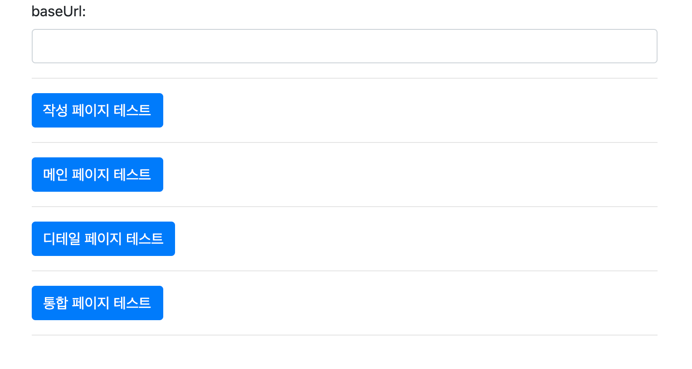
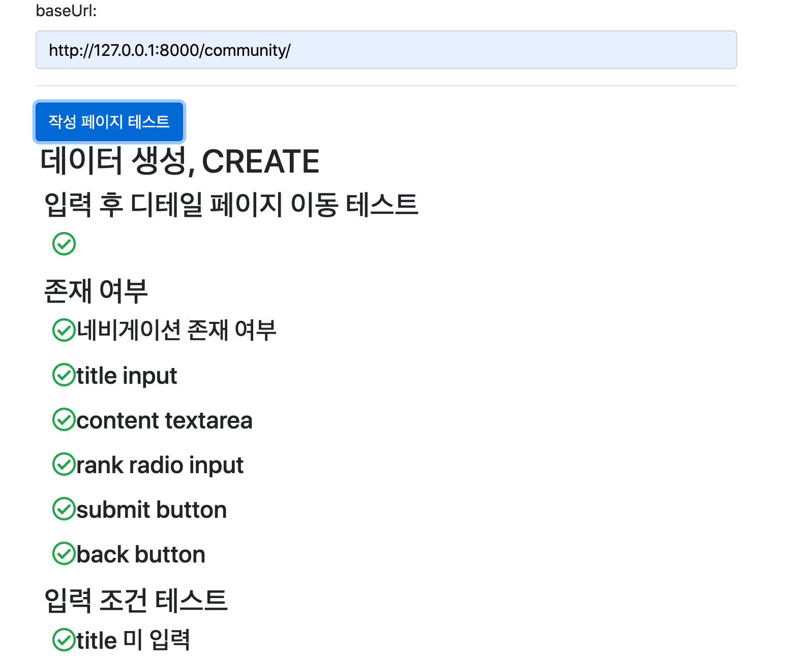
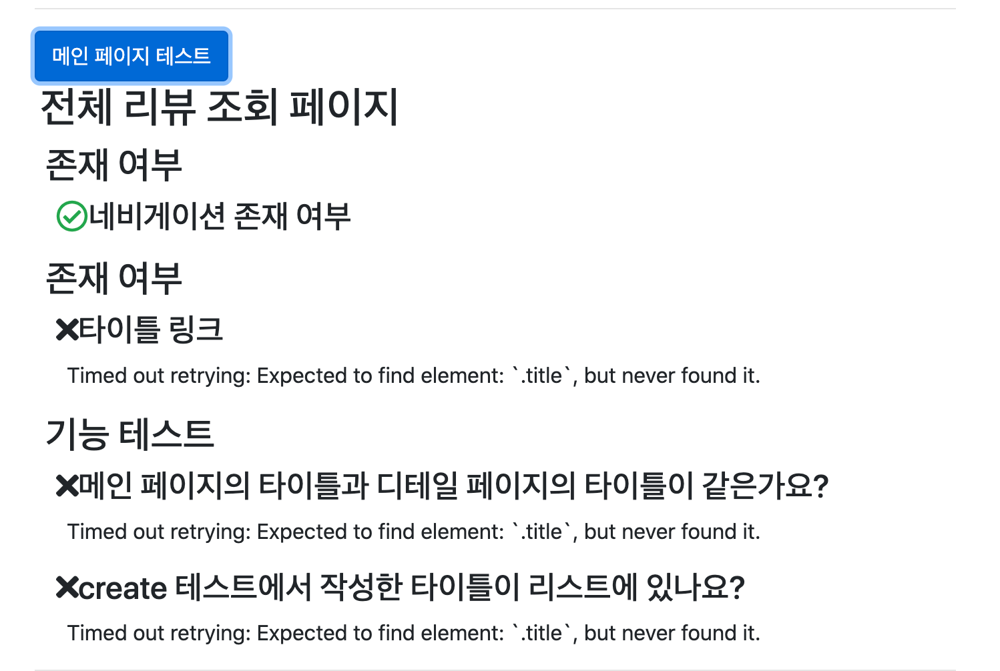
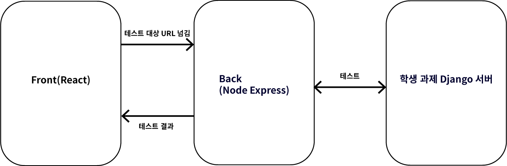

# 학생 과제 체크용 테스트 서버(20.05~20.06)

Django를 교육하면서 학생들의 과제를 쉽게 채점:pencil2: 하고 싶은 마음에 만들기 시작한 프로젝트입니다.

그러나 프로토 타입만 제작하고 더 이상 진행하지 않기로 결정하였습니다.:sob:

아래에 이유를 작성하였습니다.

## 목적

1. 강사가 학생들의 과제를 쉽게 채점
2. 학생들이 내 과제에서 무엇이 잘못되었는지 스스로 체크 가능

## 결과 화면 예시

- 메인 화면

  - 학생들은 django 프로젝트를 로컬로 돌린 다음에 ngrok으로 태워서 `baseUrl` 작성

  

- 테스트 성공 시

  

- 테스트 실패 시

  

위 그림과 같이 내가 작성한 과제에서 어떤 부분이 잘못되었는지 확인 가능합니다.

## 구조

### 프론트

CRA(Create React App)을 사용해서 환경 구성하였고, 테스트 할 URL을 서버에 넘겨주고 테스트 결과를 받아 화면에 보여주는 역할을 합니다.

### 서버

Node Express로 구성하였고, 테스트는 Cypress로 구성하였습니다. 미리 작성된 테스트를 실행하고 그 결과를 리턴합니다.

## 선택의 이유

- 왜 E2E 테스트를 하기로 했는지?
  - django에서 백엔드 테스트를 작성하면 강사가 학생들의 코드를 받아서 채점하기는 쉬워집니다. 하지만 학생들이 과제를 하면서 테스트를 진행하기에 어려운 점이 있습니다. 만약 그렇게 하려면 두 가지 방법이 있는데,
    - 학생들에게 테스트 코드를 제공하는 방법: 테스트 코드를 실행하는 법을 교육하고 결과로 나온 내용을 해석하는 법을 따로 교육해야 합니다.
    - 학생들의 코드를 clone 받아서 서버에서 테스트 하는 방법: 학생들의 과제 repo가 기본적으로 private하여 추가 조치를 해야하고, 폴더 구조나 프로젝트 이름이 강력하게 통일되어야 가능하겠다고 판단.(21.02. 지금 생각해보니 이 방법도 나쁘지 않았을 것 같다는 생각이 듭니다. 다만 repo 권한때문에 회사랑 얘기가 따로 되어야 했겠지만요)
  - 백엔드 테스트와 E2E 중 하나만 진행해야 한다면 E2E를 선택해야 한다고 생각했습니다. 화면이 잘 동작한다면 백엔드도 제대로 짰다고 생각할 수 있으니까요.
- 왜 Cypress를 사용했는지?
  - 이 프로젝트가 무조건 성공한다는 확신이 없었습니다. 빠르게 프로토타입을 작성하여 시간을 들여 작성할만한 가치가 있는지 파악하는게 1차 목적이었습니다. selenium, cypress, testCafe 등 E2E 프레임워크 중 문서가 가장 잘 읽히고 쉽게 사용할 수 있는 cypress를 선택했습니다.

## 더 이상 프로젝트를 진행하지 않은 이유

- 기존 과제를 많이 수정해야 한다
  - E2E 테스트를 위해서는 태그를 구분할 수 있도록 과제 명세가 굉장히 상세해져야 합니다. 과제의 목적은 Django를 익숙하게 사용하는데 있으므로 너무 세세한 명세때문에 학생들이 흥미를 떨어뜨리는 것은 부적절하다고 생각하였습니다.
- 과제마다 많은 시간을 들여 테스트 코드를 작성해야 한다.
  - 프로젝트를 시작할 때 생각했던 것은 지금보다 과제 채점을 훨씬 쉽게하는 것이었습니다. 물론 테스트코드 작성이 익숙해지면 차츰 나아지겠지만, 채점시간보다 테스트코드 작성시간이 더 오래 걸리는 것은 참기가 힘들었습니다.
- 테스트 시간이 오래 걸린다
  - 만약 프로젝트가 사용된다면, 특정 2시간이내에 약 200명이 넘는 학생들이 사용하게 될 것입니다. 하나의 테스트처리 시간이 로컬 기준 약 30초~90초(테스트가 실패할 수록 오래걸리더군요)가 걸리는데, 요청이 쌓이면 어떻게 해결해야할지 감을 못잡겠습니다.
  - 프로토타입이 완성되기 전까지 어떻게든 테스트에 시간을 줄여보려고 해봤습니다.
    - 테스트를 잘게 나눠보았고
    - 비동기적으로 테스트 동작
    - 해봤으나 의미있는 결과를 도출해내지 못한 채 프로토타입 완성
  - 앞선 두 가지 이유가 없었다면 좀 더 파헤쳐 봤겠지만, 의미없다고 생각하고 접게되었습니다.